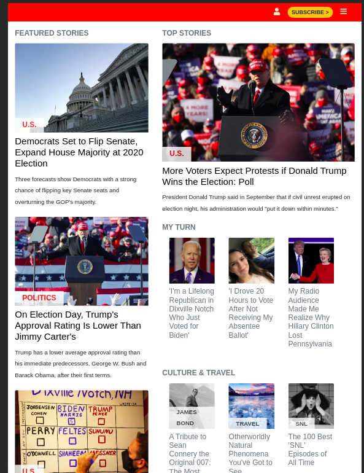

# NewsWeek website Clone

> This project is a responsive clone of newsweek (newsweek.com) website. This was built with bootsrap and sass. Bootstrap was used for responsiveness i.e. Moble UI, Tablet UI, Desktop UI. Dynamic images and content developed using bootstarp grids, cards and bootsrap breakpoints. Icons were built with bootsrap icon.

## Tablet UI

Additional description about the project and its features.

## Built With

- HTML & CSS
- SASS
- VsCode
- Font Awesome Icons
- Linters
- Gitflows

## Live Demo

[Live Demo Link](https://microverse-sessions.github.io/newsweek-clone/)

## Getting Started

**This is an example of how you may give instructions on setting up your project locally.**
**Modify this file to match your project, remove sections that don't apply. For example: delete the testing section if the currect project doesn't require testing.**

To get a local copy up and running follow these simple example steps.

### Prerequisites

### Setup

### Install

### Usage

### Run tests

### Deployment

## Authors

👤 **Adeel**

- GitHub: [@githubhandle](https://github.com/bashforger)
- Twitter: [@twitterhandle](https://twitter.com/bashforge)
- LinkedIn: [LinkedIn](https://linkedin.com/Muhammad-adeel-danish)

👤 **Azeez Ibrahim**

- GitHub: [@githubhandle](https://github.com/kunmi02)
- Twitter: [@twitterhandle](https://twitter.com/akinkunmi006)
- LinkedIn: [LinkedIn](https://linkedin.com/akinkunmi006)

## 🤝 Contributing

Contributions, issues, and feature requests are welcome!

- Forking the project
- Cloning the project to your local machine
- `cd` into the project directory
- Run `git checkout -b your-branch-name`
- Make your contributions
- Push your branch up to your forked repository
- Open a Pull Request with a detailed description to the development branch of the original project for a review

Feel free to check the [issues page](issues/).

## Show your support

Give a ⭐️ if you like this project!

## Acknowledgments

- Hat tip to anyone whose code was used
- Inspiration
- etc

## 📝 License

This project is [MIT](lic.url) licensed.
